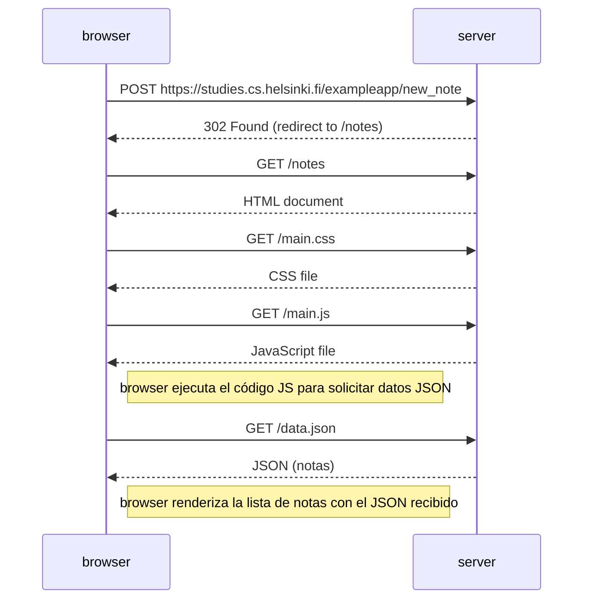
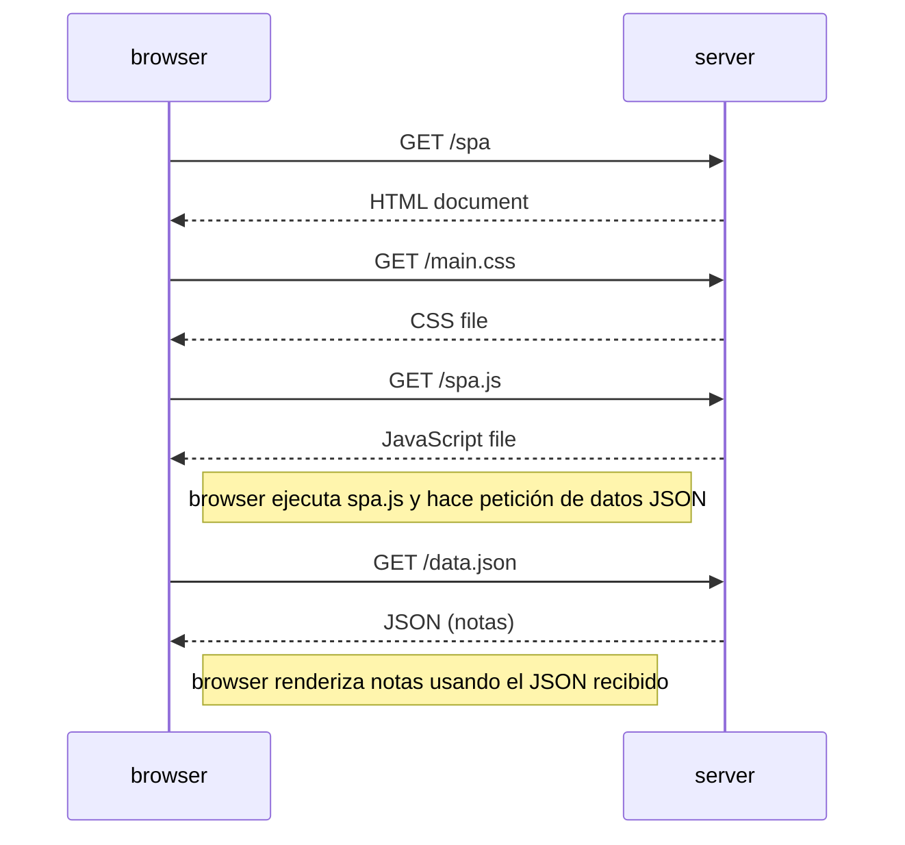

# Diagramas Parte 0 – Full Stack Open

Diagramas realizados para los ejercicios 0.4, 0.5 y 0.6 del curso.

---

## 0.4 – Nueva nota (aplicación tradicional)



---

## 0.5 – Visitar la SPA (/spa)



---

## 0.6 – Nueva nota en la SPA (corregido)

```mermaid
sequenceDiagram
    participant browser
    participant server

    Note right of browser: submit handler:<br/>preventDefault();<br/>notes.push(note); redrawNotes()

    browser->>server: POST https://studies.cs.helsinki.fi/exampleapp/new_note_spa\nContent-Type: application/json\nBody: {"content","date"}
    server-->>browser: 201 Created (JSON)

    Note right of browser: No redirect.<br/>No page reload.<br/>La UI ya muestra la nueva nota.
```
