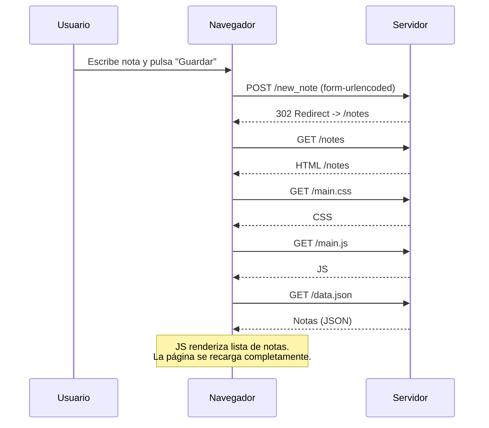
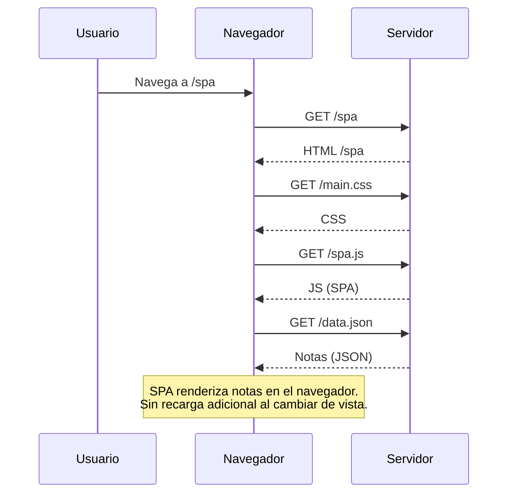

# Diagramas Parte 0 – Full Stack Open

Este documento contiene los diagramas de secuencia para los ejercicios **0.4**, **0.5** y **0.6** del curso Full Stack Open.

---

## 0.4 – Nueva nota (aplicación tradicional)



---

## 0.5 – Visitar la SPA (/spa)



---

## 0.6 – Nueva nota en la SPA

```mermaid
sequenceDiagram
    participant U as Usuario
    participant B as Navegador
    participant S as Servidor

    U->>B: Escribe nota y pulsa "Guardar"
    B->>S: POST /new_note_spa (application/json)
    S-->>B: 201 Created (JSON)

    Note over B: JS (spa.js) preventDefault();<br/>notes.push(note); redrawNotes();<br/>La página NO se recarga y la UI<br/>ya muestra la nueva nota.
```
